# Informe Final de Auditoría Integral — FONEVI

> **Documento:** Informe de Auditoría Consolidado y Plan Maestro de Remediación  
> **Fecha:** 24 de junio de 2026  
> **Versión:** 1.0 (Final Consolidado)  
> **Autor:** Arquitecto Máster de Software & Auditor Técnico  
> **Clasificación del Sistema:** 🔴 **NO APTO PARA PRODUCCIÓN** (Requiere remediación de hallazgos críticos P0 y P1)

---

## 1. Resumen Ejecutivo

El presente informe consolida los resultados de la auditoría técnica integral realizada al sistema **FONEVI**, una aplicación financiera diseñada para la administración de asociados, aportes, créditos, amortizaciones, recaudos, solidaridad y cierres mensuales de un fondo de empleados.

Tras analizar los 16 módulos funcionales y la infraestructura arquitectónica de la plataforma, se concluye que el sistema **no se encuentra en un estado apto para producción**. Si bien existe una base funcional y un esfuerzo inicial de modularización en ciertos componentes, la aplicación presenta riesgos críticos de **integridad financiera, consistencia de datos, seguridad operacional y mantenibilidad**.

### Hallazgos Estructurales Clave:

1. **Falta de Integridad Transaccional:** Procesos críticos como el cierre mensual y la distribución de aportes se inician o coordinan desde el frontend mediante múltiples peticiones HTTP independientes, sin garantías de atomicidad (transacciones SQL) en el backend.
2. **Duplicidad y Fuga de Lógica Financiera:** Múltiples reglas de negocio (cálculo de mora, tasas de interés, amortizaciones y proyecciones) se encuentran duplicadas o implementadas exclusivamente en el frontend, lo que expone al sistema a manipulaciones y discrepancias.
3. **Doble Sistema de Persistencia:** Coexisten de forma desordenada dos esquemas de acceso a datos: Prisma ORM (para autenticación, configuración y notificaciones) y un pool directo de PostgreSQL (`pg`) con consultas SQL crudas (para socios, aportes, créditos y movimientos).
4. **Vulnerabilidad de Estado en Frontend:** El uso de la variable global `window.DB` como almacenamiento maestro expone datos sensibles, carece de reactividad y genera condiciones de carrera e inconsistencias al navegar.
5. **Inexistencia de Auditoría y Trazabilidad Financiera:** No se registran desgloses históricos inmutables de los aportes o créditos, ni se cuenta con un historial de modificaciones a parámetros de configuración críticos.

---

## 2. Inventario y Madurez de los Módulos

Se evaluaron los componentes del backend y frontend bajo tres niveles de madurez arquitectónica:

- **Completa (3 capas):** Ruta Express $\rightarrow$ Controlador $\rightarrow$ Servicio $\rightarrow$ Capa de datos estructurada.
- **Parcial:** Lógica de negocio mezclada en rutas, falta de servicios independientes o bypass desde el frontend.
- **Inexistente:** Módulo ausente en backend o implementado solo a nivel de interfaz visual.

### Matriz de Madurez del Sistema

| Módulo                  | Arquitectura Backend      | Acceso a Datos    | Auditoría de Cambios | Estado de Aceptación | Observaciones                                                        |
| :---------------------- | :------------------------ | :---------------- | :------------------- | :------------------- | :------------------------------------------------------------------- |
| **Socios**              | ✅ Completa (3 capas)     | `pg` pool directo | ✅ Sí                | 🟠 Condicionado      | Requiere corregir borrado físico y validar en backend.               |
| **Aportes**             | ✅ Completa (3 capas)     | `pg` pool directo | ✅ Sí                | 🔴 No Apto           | Falta desglose atómico (`aporte_detalle`) e integridad en cierres.   |
| **Créditos**            | ✅ Completa (3 capas)     | `pg` pool directo | ✅ Sí                | 🔴 No Apto           | Lógica financiera dependiente de simulación frontend; falta ledger.  |
| **Movimientos**         | ✅ Completa (3 capas)     | `pg` pool directo | ❌ No                | 🔴 No Apto           | Cálculos y conciliaciones hechos en frontend; sin transacciones.     |
| **Autenticación**       | 🟠 Parcial (Ruta directa) | Prisma ORM        | ❌ No                | 🟠 Condicionado      | Lógica en ruta; tokens JWT correctos pero sin revocación.            |
| **Usuarios**            | 🟠 Parcial (Ruta directa) | Prisma ORM        | ❌ No                | 🟠 Condicionado      | Sin validación de esquemas robustos en backend.                      |
| **Solidaridad**         | 🟠 Parcial (Solo ruta)    | `pg` pool directo | ❌ No                | 🔴 No Apto           | Egreso de fondos sin validación de saldos ni roles adecuados.        |
| **Dividendos**          | ❌ Inexistente            | N/A               | ❌ No                | 🔴 No Apto           | No existe código en backend; interfaz frontend simulada.             |
| **Períodos y Cierre**   | 🟠 Parcial                | Prisma ORM        | ❌ No                | 🔴 No Apto           | Cierre orquestado por frontend; permite modificar períodos cerrados. |
| **Dashboard**           | 🟠 Parcial (Ruta directa) | Prisma ORM        | ❌ No                | 🔴 No Apto           | Polling masivo (13 queries consecutivas); sobrecarga la BD.          |
| **Panel de Mora**       | 🟠 Parcial                | `pg` pool directo | ❌ No                | 🔴 No Apto           | Lógica de mora no unificada; cálculos manuales en base a fechas.     |
| **Reportes**            | 🟠 Parcial                | Prisma/`pg`       | ❌ No                | 🔴 No Apto           | Exportación y sumatorias dependientes de datos del frontend.         |
| **Configuración Gral.** | 🟠 Parcial (Ruta directa) | Prisma ORM        | ❌ No                | 🔴 No Apto           | Parámetros financieros hardcodeados; sin historial de cambios.       |
| **Mi Cuenta / Perfil**  | 🟠 Parcial                | Prisma ORM        | ❌ No                | 🟠 Condicionado      | Permite edición de datos sensibles sin doble factor ni re-auth.      |
| **Notificaciones**      | 🟠 Parcial                | Prisma ORM        | ❌ No                | 🟠 Condicionado      | Bypass desde frontend para marcar como leídas de forma masiva.       |
| **WhatsApp / Envío**    | 🟠 Parcial (Solo ruta)    | Prisma ORM        | ❌ No                | 🟠 Condicionado      | Sin encolamiento de mensajes; llamadas síncronas bloqueantes.        |

---

## 3. Análisis Detallado de Riesgos Técnicos y Arquitectónicos

### RT-01: Incoherencia en la Capa de Persistencia (Doble ORM/Driver)

- **Ubicación:** `packages/backend/lib/prisma.js` frente a `packages/backend/db/index.js`.
- **Impacto:** Convenciones de nombres cruzadas (camelCase en Prisma, snake_case en PostgreSQL directo). Fugas en la gestión de la piscina de conexiones y duplicación de la lógica de conexión. Dificulta la implementación de transacciones que involucren tablas administradas por distintos drivers.
- **Solución:** Migrar progresivamente todas las consultas al cliente unificado de Prisma ORM, mapeando adecuadamente los modelos.

### RT-02: Vulnerabilidad de Estado Global (`window.DB`)

- **Ubicación:** `packages/frontend/js/app.js` e integraciones en páginas HTML.
- **Impacto:** Cualquier script inyectado o código de consola puede manipular los datos financieros en memoria. Al no haber reactividad (como en React/Vue), el frontend realiza actualizaciones de DOM directas y desordenadas. El polling constante de este objeto inunda el backend con peticiones repetitivas.
- **Solución:** Reemplazar el almacenamiento global por llamadas controladas a servicios de API y migrar a un flujo de datos unidireccional o reactivo.

### RT-03: Fuga de Reglas de Negocio al Cliente (Frontend)

- **Ubicación:** Archivos controladores de vistas en `packages/frontend/js/` (ej. calculadoras de cuotas, simuladores y totalizadores).
- **Impacto:** Si un usuario altera el código JS local, puede registrar transacciones con tasas de interés inferiores, montos de amortización inválidos o saltarse las restricciones de cupo de crédito.
- **Solución:** El frontend debe ser estrictamente de lectura y presentación. Toda regla de negocio, cálculo de tasa, seguro, mora y validación de límites debe ser ejecutada y forzada en el backend.

### RT-04: Ausencia de Transaccionalidad en Operaciones de Caja y Cierre

- **Ubicación:** Endpoints de aportes, créditos y períodos en el backend.
- **Impacto:** Si la inserción de un pago falla a mitad de camino, los aportes del socio se actualizan pero el movimiento de caja no se registra. El proceso de cierre mensual puede quedar en un estado "parcialmente cerrado" irrecuperable.
- **Solución:** Agrupar operaciones compuestas bajo bloques transaccionales (`prisma.$transaction` o transacciones de base de datos nativas).

---

## 4. Consolidado de Hallazgos y Clasificación de Prioridades

```mermaid
graph TD
    P0[Prioridad P0: Crítico - Bloquea Producción] --> P0_1(Eliminar Valores Hardcodeados)
    P0 --> P0_2(Cierre Mensual Atómico Backend)
    P0 --> P0_3(Bloqueo de Períodos Cerrados)
    P0 --> P0_4(Seguridad en Solidaridad y Créditos)

    P1[Prioridad P1: Alta - Integridad Financiera] --> P1_1(Ledger de Aportes: aporte_detalle)
    P1 --> P1_2(Ledger de Créditos: credito_movimiento)
    P1 --> P1_3(Tabla de Cierre: cierre_periodo)
    P1 --> P1_4(Historial de Configuración)

    P2[Prioridad P2: Media - Optimización] --> P2_1(Refactorización de Reportes y Dashboard)
    P2 --> P2_2(Normalización y Soft-Delete)

    P3[Prioridad P3: Baja - UX/Visual] --> P3_1(Mejoras de Exportación y Gráficos)
```



### 🔴 Prioridad P0: Críticos (Bloquean el paso a producción)

1. **Eliminación de Valores Financieros Hardcodeados:**
   - **Problema:** El valor del aporte a solidaridad, el porcentaje de seguro de cartera y tasas de interés están escritos directamente en el código fuente.
   - **Acción:** Mover todos los parámetros a la tabla `configuracion` y consumirlos mediante un servicio común en el backend.

2. **Cierre Mensual Atómico en Backend:**
   - **Problema:** El cierre mensual se realiza enviando múltiples peticiones secuenciales desde el navegador. Si la conexión falla, los datos quedan corruptos.
   - **Acción:** Implementar un único endpoint `/api/periodos/cerrar` que ejecute todo el proceso dentro de una transacción SQL, valide el período anterior y genere un respaldo automático del estado financiero.

3. **Bloqueo de Modificaciones en Períodos Cerrados:**
   - **Problema:** Se pueden registrar, editar o eliminar aportes y créditos en meses ya cerrados contablemente.
   - **Acción:** Crear un middleware o validación a nivel de servicio que rechace cualquier operación de escritura si la fecha de la transacción corresponde a un período con estado `CERRADO`.

4. **Seguridad y Autorización en Egresos de Solidaridad:**
   - **Problema:** Los endpoints de egresos de solidaridad carecen de validación estricta de saldos disponibles y permisos de rol administrativo.
   - **Acción:** Validar el saldo del fondo de solidaridad antes de autorizar el egreso y restringir el endpoint a roles de tesorería/administrador.

---

### 🟡 Prioridad P1: Alta (Garantizan la consistencia e integridad contable)

1. **Creación del Ledger de Aportes (`aporte_detalle`):**
   - **Problema:** Los aportes se registran como un único valor consolidado, dificultando conocer qué porción corresponde a ahorro obligatorio, solidaridad, o abonos a cartera.
   - **Acción:** Diseñar la tabla `aporte_detalle` para almacenar el desglose exacto de cada recaudo.

2. **Creación del Ledger de Créditos (`credito_movimiento`):**
   - **Problema:** No existe un historial inmutable de las transacciones de un crédito (desembolso, pago de interés, abono a capital, cobro de seguro, generación de mora).
   - **Acción:** Implementar la tabla `credito_movimiento` para registrar la trazabilidad histórica de cada obligación financiera.

3. **Registro Histórico de Cierres (`cierre_periodo`):**
   - **Problema:** No hay un registro de control de quién cerró el período, en qué fecha, con qué saldos consolidados y qué copia de respaldo se generó.
   - **Acción:** Crear la entidad `cierre_periodo` para almacenar metadatos del cierre y firmas electrónicas o hashes de integridad.

4. **Historial de Auditoría de Configuración (`configuracion_historial`):**
   - **Problema:** Los cambios en tasas de interés o políticas del fondo se sobreescriben sin dejar rastro de quién realizó el cambio o bajo qué justificación.
   - **Acción:** Implementar una tabla de auditoría para cambios en configuraciones del sistema.

---

### 🔵 Prioridad P2: Media (Optimización y deuda técnica)

1. **Optimización del Dashboard y Control de Polling:**
   - **Problema:** El frontend realiza consultas masivas repetitivas en intervalos cortos, saturando el pool de conexiones de la base de datos.
   - **Acción:** Implementar almacenamiento en caché (in-memory o Redis) para las métricas del dashboard y aumentar la tolerancia del polling.
2. **Normalización de Respuestas de API:**
   - **Problema:** Formatos de error y éxito inconsistentes a lo largo del backend.
   - **Acción:** Crear un interceptor o middleware de formateo estándar de respuestas HTTP.
3. **Implementación de Soft-Delete:**
   - **Problema:** La eliminación de socios y registros críticos ejecuta un `DELETE` físico en la base de datos, perdiendo historial.
   - **Acción:** Añadir columnas `deleted_at` y `deleted_by` a las entidades principales y filtrar por defecto en consultas de lectura.

---

### 🟢 Prioridad P3: Baja (Mejoras visuales y de usabilidad)

1. **Mejoras en Exportaciones:** Garantizar que las exportaciones a PDF/Excel de los reportes se generen en el backend para evitar discrepancias de formato y datos en el navegador.
2. **Interfaz Gráfica del Dashboard:** Reemplazar gráficos pesados por componentes visuales ligeros y unificados bajo una misma paleta estética.

---

## 5. Plan de Acción y Hoja de Ruta de Remediación

Se propone un plan estructurado en 4 fases secuenciales para llevar a FONEVI a un estado de producción óptimo:

```
[ Fase 1: Estabilización Crítica ] (P0)
               │
               ▼
[ Fase 2: Integridad Financiera ] (P1)
               │
               ▼
[ Fase 3: Trazabilidad y Auditoría ] (Servicios & Logs)
               │
               ▼
[ Fase 4: Refactorización y Patrones ] (Clean Architecture)
```

### Fase 1: Estabilización Crítica (P0) — _Estimación: 2 Semanas_

- **Meta:** Eliminar los riesgos de seguridad inminentes y fallos catastróficos en procesos contables.
- **Entregables:**
  - Migración de parámetros financieros del código a la tabla de configuración.
  - Endpoint único de cierre mensual transaccional con bloqueo de escritura en meses cerrados.
  - Asegurar endpoints de solidaridad y validaciones de saldos en backend.

### Fase 2: Integridad Financiera y Ledger (P1) — _Estimación: 3 Semanas_

- **Meta:** Establecer un modelo de datos robusto y auditable para el manejo del dinero.
- **Entregables:**
  - Creación e integración de las tablas `aporte_detalle` y `credito_movimiento`.
  - Implementación de la tabla `cierre_periodo` y automatización de respaldos de base de datos antes del cierre.
  - Refactorización de servicios de cobro y recaudos para usar el nuevo modelo de transacciones atómicas.

### Fase 3: Trazabilidad y Auditoría — _Estimación: 2 Semanas_

- **Meta:** Garantizar que todo cambio administrativo y del sistema sea rastreable y transparente.
- **Entregables:**
  - Creación de `configuracion_historial`.
  - Integración del middleware de auditoría en todos los módulos del backend (actualmente ausente en el 60% de ellos).
  - Monitoreo y estructuración de logs de error en el servidor.

### Fase 4: Refactorización de Arquitectura y APIs — _Estimación: 3 Semanas_

- **Meta:** Resolver la deuda técnica, unificar accesos a datos y desacoplar el frontend del backend.
- **Entregables:**
  - Migración completa de consultas `pg` pool directo hacia Prisma ORM.
  - Estandarización de las respuestas de la API.
  - Eliminación de `window.DB` en el frontend, sustituyéndolo por peticiones bajo demanda y control de estado local.

---

## 6. Estado de Remediación (24 Jun 2026)

A continuación se detalla el estado de cada hallazgo tras la sesión de remediación quirúrgica.

### 🔴 Prioridad P0 — Críticos

| ID   | Hallazgo                  | Estado      | Detalle del cambio                                                                                                                                                                                                                               |
| ---- | ------------------------- | ----------- | ------------------------------------------------------------------------------------------------------------------------------------------------------------------------------------------------------------------------------------------------ |
| P0-1 | Valores hardcodeados      | ✅ Resuelto | Todos los parámetros financieros (`tasa_interes_mensual`, `porcentaje_seguro`, `valor_solidaridad`, `valor_minimo_aporte`, `multiplicador_maximo_credito`) migrados a tabla `configuracion` con seed. `ConfiguracionService` centraliza lectura. |
| P0-2 | Cierre mensual atómico    | ✅ Resuelto | Endpoint único `POST /api/cierre-periodo/ejecutar` con transacción SQL (`$transaction`), validación de período activo, registro de metadata en `cierres_periodo`, y auditoría.                                                                   |
| P0-3 | Bloqueo períodos cerrados | ✅ Resuelto | `RegistrarAporteUseCase`, `ActualizarAporteUseCase`, `EliminarAporteUseCase` validan `periodo.activo` antes de mutar.                                                                                                                            |
| P0-4 | Seguridad solidaridad     | ✅ Resuelto | `RegistrarSolidaridadUseCase` valida saldo disponible antes de egresos. Ruta requiere `authorize('admin', 'superadmin')`.                                                                                                                        |

### 🟡 Prioridad P1 — Alta

| ID   | Hallazgo                                            | Estado          | Detalle del cambio                                                                                                                                                                                                     |
| ---- | --------------------------------------------------- | --------------- | ---------------------------------------------------------------------------------------------------------------------------------------------------------------------------------------------------------------------- |
| P1-1 | Ledger aportes (`aporte_detalle`)                   | ✅ Preexistente | Tabla `aporte_detalles` ya existente en esquema, creada antes de esta sesión.                                                                                                                                          |
| P1-2 | Ledger créditos (`credito_movimiento`)              | ✅ Resuelto     | Nueva tabla `credito_movimientos` creada. `SolicitarCreditoUseCase` registra `desembolso`, `PagarCuotaUseCase` registra `pago_cuota`, `EliminarPagoCuotaUseCase` registra `reversion`. Todos dentro de `$transaction`. |
| P1-3 | Metadata cierre (`cierre_periodo`)                  | ✅ Resuelto     | Nueva tabla `cierres_periodo` con quién ejecutó el cierre, fecha, saldos consolidados (`totalRecaudado`, `totalSolidaridad`, `totalAhorro`, `totalAplicadoCreditos`, `totalSociosAportaron`, `totalAportes`).          |
| P1-4 | Historial configuración (`configuracion_historial`) | ✅ Resuelto     | Nueva tabla `configuracion_historial` registra `valorAnterior`, `valorNuevo` y `usuarioId` en cada actualización. `ActualizarConfigUseCase` modificado para inyectar `usuarioId`.                                      |

### 🔵 Prioridad P2 — Media

| ID   | Hallazgo                  | Estado          | Detalle del cambio                                                                                                         |
| ---- | ------------------------- | --------------- | -------------------------------------------------------------------------------------------------------------------------- |
| P2-1 | Caché dashboard / polling | ✅ Resuelto     | `SimpleCache` in-memory con TTL 20s en `ObtenerResumenDashboardUseCase`. Polling frontend reducido de 30s → 60s.           |
| P2-2 | Normalización APIs        | ✅ Preexistente | Middleware `apiResponse` (`success`, `error`, `paginated`) y `errorHandler` ya implementados en toda la API.               |
| P2-3 | Soft-delete               | ✅ Preexistente | Modelos `Socio` y `Credito` ya tienen `deletedAt` y métodos `softDelete`. Consultas filtran `deletedAt: null` por defecto. |

### 🟢 Prioridad P3 — Baja

| ID   | Hallazgo                   | Estado       |
| ---- | -------------------------- | ------------ | -------------------------------------------------------------------------------------------------------------------------------------------------------------------------------------------------------------- |
| P3-1 | Exportaciones backend      | ✅ Resuelto  | Nuevo endpoint `GET /api/exportar/:tipo/:formato` (dashboard, balance-general, cartera en xlsx/pdf). Backend genera archivos con `xlsx` y `pdfkit`. Dashboard usa `downloadExport()` que descarga del backend. |
| P3-2 | Mejoras visuales dashboard | ⏳ Pendiente |

### Hallazgos adicionales resueltos

| Hallazgo                                           | Detalle                                                                                                                                                                                                             |
| -------------------------------------------------- | ------------------------------------------------------------------------------------------------------------------------------------------------------------------------------------------------------------------- |
| Token TTL hardcodeado                              | Movido a `config/index.ts` con vars `JWT_REFRESH_EXPIRES_IN` y `JWT_REFRESH_TTL_MS`.                                                                                                                                |
| Transaccionalidad multi-write (RT-04)              | 6 use cases envueltos en `prisma.$transaction`: `RegistrarSolidaridadUseCase`, `PagarCuotaUseCase`, `EliminarPagoCuotaUseCase`, `ActualizarAporteUseCase`, `EliminarAporteUseCase`, `EjecutarCierrePeriodoUseCase`. |
| Eliminación de `reservas` y `valor_ahorro_mensual` | Eliminados del seed, servicios y frontend. Eran valores hardcodeados que ya no aplican al modelo de negocio actual.                                                                                                 |
| Sidebar responsive                                 | Drawer overlay en mobile (<768px) con hamburguesa + backdrop.                                                                                                                                                       |
| Topbar responsive                                  | Fecha oculta en mobile, iconos compactos.                                                                                                                                                                           |
| Simulador crédito                                  | Input monto editable (type text + inputMode numeric), plazo 1-36 meses.                                                                                                                                             |
| Rate-limit + trust proxy                           | `app.set('trust proxy', 1)` + SQL trailing comma fix (dashboard 500).                                                                                                                                               |
| Columnas faltantes notificaciones                  | `referencia_id` y `referencia_tipo` agregadas manualmente a DB.                                                                                                                                                     |

---

## 7. Conclusión y Veredicto

El sistema **FONEVI** cuenta con una base de lógica de negocio valiosa y un diseño de interfaz inicial adecuado para los usuarios del fondo de empleados. Sin embargo, **la falta de controles estrictos en el backend, la ausencia de transacciones en operaciones monetarias críticas y la distribución de reglas de negocio en el frontend hacen que su despliegue en producción represente un riesgo operativo y financiero inaceptable.**

La implementación del plan de remediación propuesto en este informe permitirá transformar a FONEVI en una plataforma robusta, segura, auditable y escalable, garantizando la confianza de los asociados y la integridad de sus recursos financieros.

---

_Fin del Informe._
